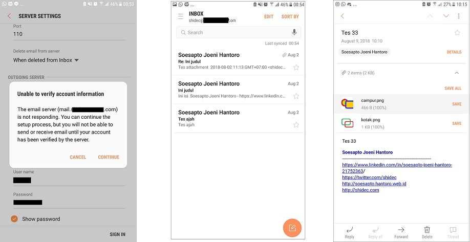

smtpd + imapd + pop3d
=========================================================

Testing POP3
=========================================================
* Open mail client such as Thunderbird, or Mobile Phone Email App
* Click "Continue" when it say can't verify account.

* It tested successfully on Thuderbird and Samsung Email App

Testing SMTP
=========================================================
* Open web interface (http://domain:10025)
* Register an account
* Send email to this account
* Open web interface (http://domain:10025) to read email

Testing IMAP
=========================================================
* Open mail client such as Thunderbird
* Add new email account, don't use autodetect setting, then click "Done" button.

SMPTPD -> Postfix connection diagram
=========================================================

Features
=========================================================

* Pop3
* Send email using Mail Transfer Agent
* ESMTP server implementing RFC5321
* Support for SMTP AUTH (RFC4954) and PIPELINING (RFC2920)
* Multipart MIME support
* UTF8 support for subject and message
* Web interface to view messages (plain text, HTML or source)
* Html sanitizer for html mail in web interface
* Real-time updates using websocket
* Download individual attachments
* MongoDB storage for message persistence
* Lightweight and portable
* No installation required

Development Status
=========================================================

SMTPD + IMAPD + POP3 is currently development phase.

TODO
=========================================================

* Rest API
* Inline resources in Web interface
* Per user/domain mailbox in web interface

Building from Source
=========================================================

You will need a functioning [Go installation][Golang] for this to work.

Grab the Smtpd source code and compile the daemon:

    go get -v github.com/shidec/smtpd

Edit etc/mail.conf and tailor to your environment. Launch the daemon:

    $GOPATH/bin/smtpd -config=$GOPATH/src/github.com/shidec/smtpd/etc/mail.conf

By default the SMTP server will be listening port 25,
IMAP server will be listening port 143 and
the web interface will be available at [domain:10025]

This will place smtpd in the background and continue running

	/usr/bin/nohup /home/shidec/smtpd -config=/home/shidec/mail.conf -logfile=smtpd.log 2>&1 &

You may also put another process to watch your smtpd process and re-start it
if something goes wrong.

Credits
=========================================================
* https://github.com/flashmob/go-guerrilla
* https://github.com/jhillyerd/inbucket
* https://github.com/ian-kent/Go-MailHog
* https://github.com/briankassouf/incus
* https://github.com/microcosm-cc/bluemonday
* http://gorillatoolkit.org

Licence
=========================================================

Copyright ©‎ 2014, Gleez Technologies (http://www.gleeztech.com).

Released under MIT license, see [LICENSE](license) for details.